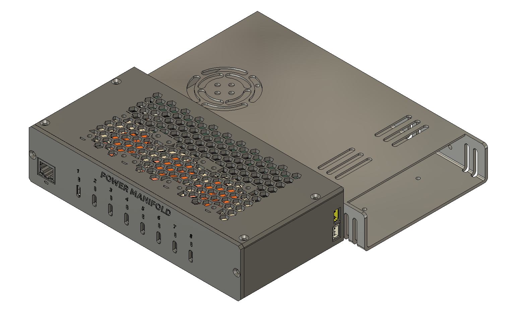
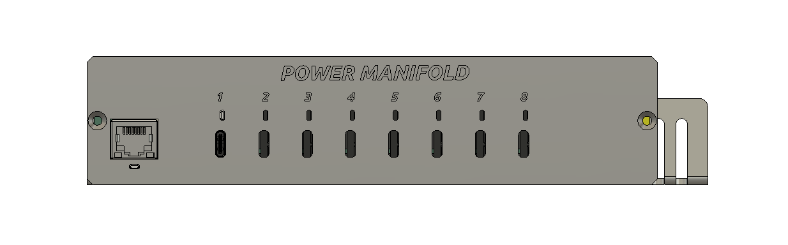
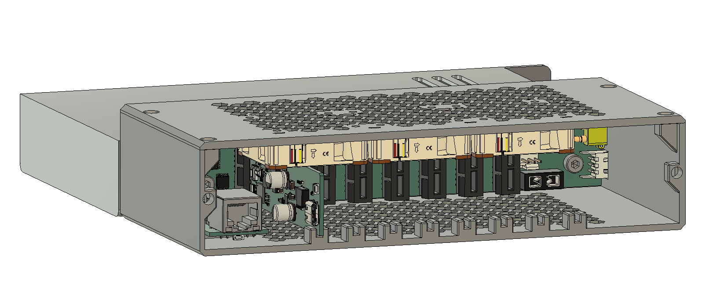
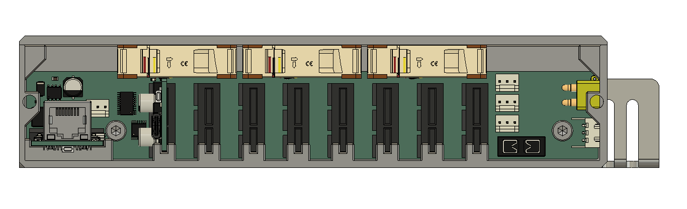

# Power Manifold

Power Manifold is a modular 8-port USB-C Smart PDU kit for SBCs such as Raspberry Pi and [PCs with barrel plugs like NUCs](https://www.adafruit.com/product/5452), with optional support for an integrated UPS battery backup. It consists of a wired ethernet control module with MQTT support, a power backplane and slots for up to 8x 100W USB-C charging modules with RGB status LEDs. The 3D-printable case has a 1U form-factor and fits in a 10" half-rack or two-abreast in a full size 19" rack.

# Images
  
  
  
  
