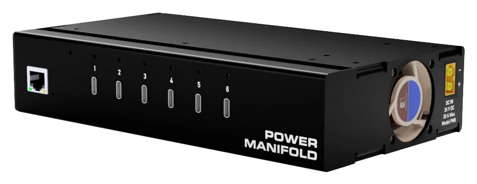

# Power Manifold

A six-port USB-C power supply: up to 100 W per port from one 24 V supply,
with per-port control, priority-based power sharing and Home Assistant
support. This repository holds the hardware (KiCad), the firmware and the
documentation site.

**Documentation:** <https://docs.powermanifold.io/>

- [First-time setup](https://docs.powermanifold.io/setup/first-time-setup/)
- [User guide](https://docs.powermanifold.io/guide/front-panel/)
- [Integrations](https://docs.powermanifold.io/integrations/mqtt/): MQTT,
  Home Assistant and the HTTP API
- [Hardware architecture](https://docs.powermanifold.io/developers/architecture/)

## Repository layout

| Path | Contents |
| --- | --- |
| `hardware/backplane` | Backplane KiCad project |
| `hardware/backplane-backer` | Insulating FR4 backer plate between the backplane and the rear wall |
| `hardware/charger-module` | Charger blade KiCad project |
| `hardware/controller` | Management controller card KiCad project |
| `hardware/left-side-plate` | Left chassis side plate, fabricated as a bare PCB |
| `hardware/pcie-breakout` | Pico 2 W development carrier for the management slot |
| `hardware/status-strip` | Front-panel status LED strip |
| `hardware/libraries` | Shared KiCad symbols and footprints |
| `hardware/CAD` | STEP exports of the boards |
| `firmware/controller` | Management controller firmware (RP2350) and its host tests |
| `firmware/charger-module` | Charger blade firmware (STM32G071) and its host tests |
| `firmware/update-proxy` | Cloudflare Worker that serves controller update images |
| `docs` | The documentation site (Astro and Starlight) |

Each firmware directory has a short README with build commands. Its full
developer documentation is in its `docs/` directory and is published on the
documentation site.

CI exports KiCad fabrication outputs when a board changes, and
release-please cuts a release for each component.

## License

Copyright 2024-2026 Michael Smith.

| Part | License |
| --- | --- |
| Hardware designs in `hardware/` | CERN-OHL-P-2.0 ([LICENSE-hardware](LICENSE-hardware)) |
| Documentation: Markdown files (`.md`, `.mdx`), the screenshots in `docs/src/assets/` and the site icon `docs/public/favicon.svg` | CC BY 4.0 ([LICENSE-docs](LICENSE-docs)) |
| Product renders: the images in `img/` and `docs/public/hero.webp` | None, all rights reserved |
| Everything else, including the firmware, the web page, the tools and the code of the documentation site | MIT ([LICENSE](LICENSE)) |

Third-party material keeps its own terms:

- `hardware/libraries/`: symbols, footprints and 3D models, most of them
  from the KiCad libraries, EasyEDA and part makers.
- Third-party 3D models inside the board exports in `hardware/CAD/`.
- `firmware/controller/lib/monocypher/`: CC0 or BSD-2-Clause, see its
  `LICENCE.md`.

Libraries that the firmware builds download, such as the Pico SDK and ST's
USB-PD stack, are not part of this repository. Each firmware release lists them and
their licenses in its SBOM (`.cdx.json`).
