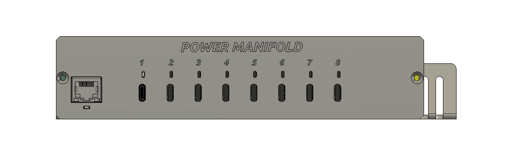
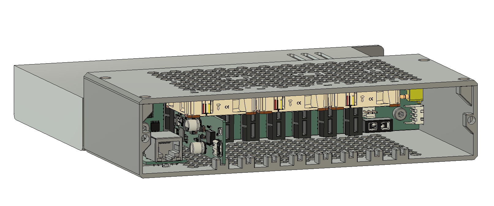
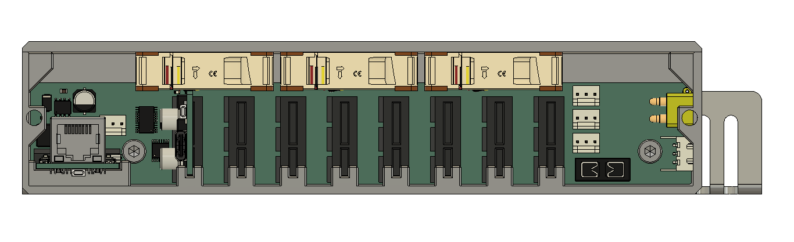

import { Card, CardGrid } from '@astrojs/starlight/components';

Power Manifold is a managed USB Power Delivery supply for racks of SBCs such as
Raspberry Pi, and for PCs that take a barrel plug. Six hot-swappable charger
blades sit in a backplane behind a single RP2350 management controller that
budgets power across the chassis, drives per-port status LEDs, and exposes
everything over MQTT, HTTP, and a serial CLI. The 3D-printable case is 1U and
fits a 10" half-rack, or two-abreast in a 19" rack.

<CardGrid stagger>
	<Card title="Six 100 W USB-C ports" icon="puzzle">
		Each blade is an MPQ4242 buck-boost USB-PD source with an INA226 monitor,
		on a PCIe x1 card edge so blades can be swapped without tools.
	</Card>
	<Card title="Centralized control" icon="setting">
		One dual-core RP2350 supervises all ports through an I2C mux, enforces a
		chassis power budget with per-port priorities, and steps ports down
		before the input supply is oversubscribed.
	</Card>
	<Card title="Home Assistant native" icon="star">
		MQTT discovery publishes every port, the fan, faults, and energy
		counters. Firmware updates show up as a Home Assistant update entity.
	</Card>
	<Card title="Wired or wireless" icon="information">
		Develop on a Pico 2 W over WiFi; ship on the custom controller with a
		W6100 wired-Ethernet controller. [Improv BLE](setup/wifi-provisioning/)
		handles first-time provisioning either way.
	</Card>
</CardGrid>

## Renders

